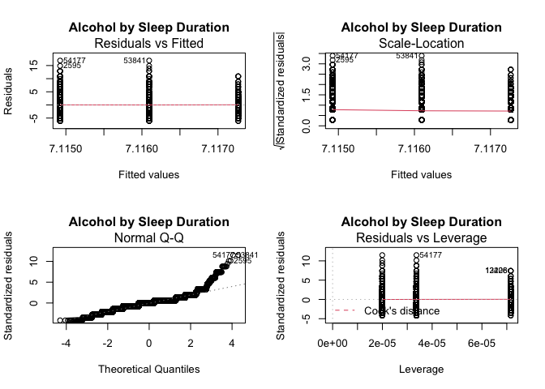
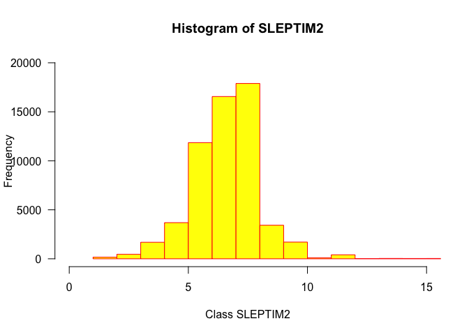
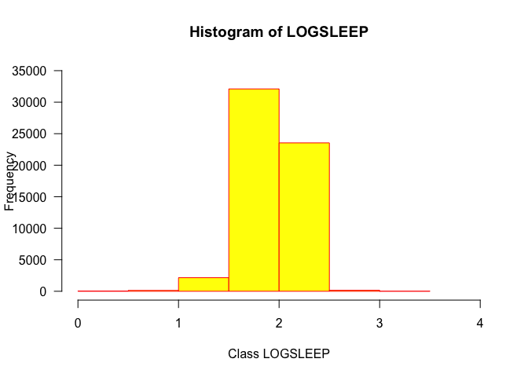
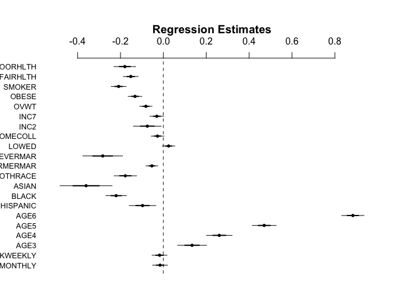
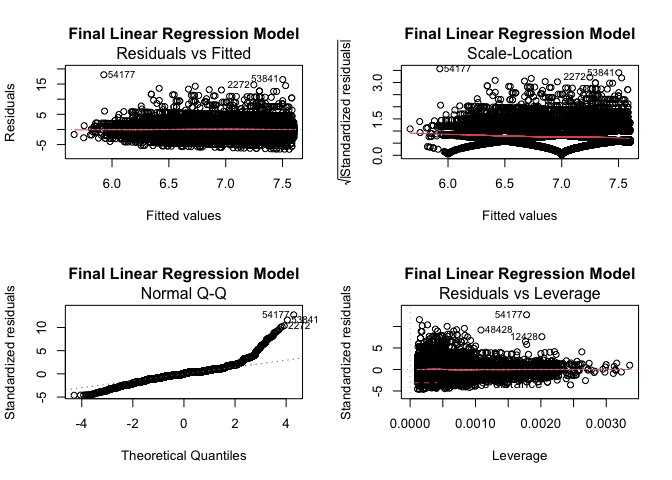

Healthcare Analytics in R - LinkedIn Learning
================
Deise Gonçalves
5/3/2022

#### Compilation of r scripts in a markdown format to make it easier to visualize the entire course in single place.

## Chapter 2 - Sections 1 to 4

Tips: Add your own path! Take a look at the table before continuing, understand the variables you are dealing with

``` r
#read in analytic table
analytic <- read.csv(file="/Users/deisejpg/git_repositories/courses/Healthcare_Regression_R/data/ch00_analytic.csv", header=TRUE, sep=",")

#Normal probability plot
#make linear model using grouping variable
AlcSleepTimeRegression = lm(SLEPTIM2 ~ ALCGRP, data=analytic) 

AlcSleepTimeRegression 
```

    ## 
    ## Call:
    ## lm(formula = SLEPTIM2 ~ ALCGRP, data = analytic)
    ## 
    ## Coefficients:
    ## (Intercept)       ALCGRP  
    ##    7.113753     0.001171

``` r
summary(AlcSleepTimeRegression)
```

    ## 
    ## Call:
    ## lm(formula = SLEPTIM2 ~ ALCGRP, data = analytic)
    ## 
    ## Residuals:
    ##     Min      1Q  Median      3Q     Max 
    ## -6.1173 -1.1149 -0.1149  0.8839 16.8851 
    ## 
    ## Coefficients:
    ##             Estimate Std. Error t value Pr(>|t|)    
    ## (Intercept) 7.113753   0.015596 456.129   <2e-16 ***
    ## ALCGRP      0.001171   0.008396   0.139    0.889    
    ## ---
    ## Signif. codes:  0 '***' 0.001 '**' 0.01 '*' 0.05 '.' 0.1 ' ' 1
    ## 
    ## Residual standard error: 1.469 on 58129 degrees of freedom
    ## Multiple R-squared:  3.347e-07,  Adjusted R-squared:  -1.687e-05 
    ## F-statistic: 0.01945 on 1 and 58129 DF,  p-value: 0.8891

 *The first column has the graphs:* Top: residuals vs. predicted values to check for linear and additive relationship between dependent and indepented variables and homoscedasticity
Bottom: Q-Q plot depicting normal probability plot
Both mostly meet the assumption of normal probability of continuous dependent variables for regression Analyses.

But what to do when the assumptions are not met?

## Chapter 2 - Section 5

When the assumptions are not met one can use categorization ans transformation of the data to deal with continuous dependent variables as follows:

``` r
#copy to new dataset
BRFSS_sleep <- analytic

#summary statistics
summary(BRFSS_sleep$SLEPTIM2)
```

    ##    Min. 1st Qu.  Median    Mean 3rd Qu.    Max. 
    ##   1.000   6.000   7.000   7.116   8.000  24.000

``` r
#look at histogram
hist(BRFSS_sleep$SLEPTIM2, 
    main = "Histogram of SLEPTIM2",
    xlab = "Class SLEPTIM2",
    ylab = "Frequency",
    xlim=c(0,15), 
    ylim=c(0,20000),
    border = "red",
    col= "yellow",
    las = 1,
    breaks = 24)
```

 Using summary() we can see the median. Checking the histogram it is possible to see the distribution of the data.
Now we can use this to subdivide the variable into two categories separated at the median value.

``` r
#categorize at median
BRFSS_sleep$SLEEPCAT <- 9
BRFSS_sleep$SLEEPCAT[BRFSS_sleep$SLEPTIM2 >7] <- 1
BRFSS_sleep$SLEEPCAT[BRFSS_sleep$SLEPTIM2 <=7] <- 2
table(BRFSS_sleep$SLEEPCAT, BRFSS_sleep$SLEPTIM2)
```

    ##    
    ##         1     2     3     4     5     6     7     8     9    10    11    12
    ##   1     0     0     0     0     0     0     0 17889  3426  1705   111   411
    ##   2    38   134   465  1687  3690 11854 16557     0     0     0     0     0
    ##    
    ##        13    14    15    16    17    18    20    21    22    24
    ##   1    19    38    32    35     3    24     8     1     2     2
    ##   2     0     0     0     0     0     0     0     0     0     0

Another strategy is to use log transformation. However, the interpretation of log values in healthcare is unintuitive.

``` r
#log transformation

BRFSS_sleep$LOGSLEEP <- log(BRFSS_sleep$SLEPTIM2)

summary(BRFSS_sleep$LOGSLEEP)
```

    ##    Min. 1st Qu.  Median    Mean 3rd Qu.    Max. 
    ##   0.000   1.792   1.946   1.939   2.079   3.178

``` r
hist(BRFSS_sleep$LOGSLEEP, 
    main = "Histogram of LOGSLEEP",
    xlab = "Class LOGSLEEP",
    ylab = "Frequency",
    xlim=c(0,4), 
    ylim=c(0,35000),
    border = "red",
    col= "yellow",
    las = 1,
    breaks = 5)
```



## Chapter 2 - Section 6

Here we went through indexing a variable that does not meet the assumption. The example dataset was not provided so I only read and understood the code, but did not replicate it here. It uses an equation to combine several categorical variables that measure similar topics together resulting in an ordinal variable. The example given was of three variables measuring cardiovascular diseases. Collapses related categorical variables into one continuous variable following a formula. heart attack - HA coronary heart disease - CHD stroke - STRK

answers coded as: yes - 1 no - 2

vasc\_index &lt;- starts an empty column then add HA + CHD + STRK and store that in vasc\_index check it using table() plot a histogram to check the distribution (the example data was skewed)

## Chapter 2 - Section 7

``` r
#copy to new dataset
BRFSS_sleep <- analytic

#summary statistics
#summary(BRFSS_sleep)
summary(BRFSS_sleep$SLEPTIM2)
```

    ##    Min. 1st Qu.  Median    Mean 3rd Qu.    Max. 
    ##   1.000   6.000   7.000   7.116   8.000  24.000

``` r
#quartiles of SLEPTIM2
SLEEPQuantiles <- quantile(BRFSS_sleep$SLEPTIM2)
SLEEPQuantiles
```

    ##   0%  25%  50%  75% 100% 
    ##    1    6    7    8   24

``` r
#start the new variable 'SLEPQUART' with default value of 9
BRFSS_sleep$SLEPQUART <- 9
BRFSS_sleep$SLEPQUART[BRFSS_sleep$SLEPTIM2 <= 6] <- 1 #code for the first quantile
BRFSS_sleep$SLEPQUART[BRFSS_sleep$SLEPTIM2 >6 & BRFSS_sleep$SLEPTIM2 <=7] <- 2 #code for the second quantile
BRFSS_sleep$SLEPQUART[BRFSS_sleep$SLEPTIM2 >7 & BRFSS_sleep$SLEPTIM2 <=8] <- 3 #code for the third quantile
BRFSS_sleep$SLEPQUART[BRFSS_sleep$SLEPTIM2 >8] <- 4 #code for the fourth quantile

table(BRFSS_sleep$SLEPQUART, BRFSS_sleep$SLEPTIM2)
```

    ##    
    ##         1     2     3     4     5     6     7     8     9    10    11    12
    ##   1    38   134   465  1687  3690 11854     0     0     0     0     0     0
    ##   2     0     0     0     0     0     0 16557     0     0     0     0     0
    ##   3     0     0     0     0     0     0     0 17889     0     0     0     0
    ##   4     0     0     0     0     0     0     0     0  3426  1705   111   411
    ##    
    ##        13    14    15    16    17    18    20    21    22    24
    ##   1     0     0     0     0     0     0     0     0     0     0
    ##   2     0     0     0     0     0     0     0     0     0     0
    ##   3     0     0     0     0     0     0     0     0     0     0
    ##   4    19    38    32    35     3    24     8     1     2     2

One can also make quintiles or tertiles. This approach is good because the quantiles are evenly distributed across categories, however they have unintuitive limits.

## Chapter 2 - Section 8

Ranking is an option when the continous data is not normally distributed. Often happens when the sample is very small (like in dentist data) or very large (e.g., platelet count) Create a rank variable based on the variable in question and use that in analysis. This is a nonparametric analysis because the rank does not assume a distribution of the data.

``` r
#Create rank
order.sleeptime <- order(-BRFSS_sleep$SLEPTIM2)

#create a new variable 'BRFSS_sleep2' by selecting the data from variable BRFSS_sleep
#and getting the data sorted from largest sleep time to smalest sleep time
BRFSS_sleep2 <- BRFSS_sleep[order.sleeptime,]

#rank command used and data stored in the new variable 'SLEPRANK'
BRFSS_sleep2$SLEPRANK <- rank(BRFSS_sleep2$SLEPTIM2)

#within brackets what is before the comma is row and after the comma is column
head(BRFSS_sleep2[,c("SLEPRANK","SLEPTIM2")], n=25)
```

    ##       SLEPRANK SLEPTIM2
    ## 53841  58130.5       24
    ## 54177  58130.5       24
    ## 2272   58128.5       22
    ## 2595   58128.5       22
    ## 10695  58127.0       21
    ## 10518  58122.5       20
    ## 17468  58122.5       20
    ## 25197  58122.5       20
    ## 41117  58122.5       20
    ## 47996  58122.5       20
    ## 48428  58122.5       20
    ## 49772  58122.5       20
    ## 56337  58122.5       20
    ## 2267   58106.5       18
    ## 5524   58106.5       18
    ## 8312   58106.5       18
    ## 8636   58106.5       18
    ## 9636   58106.5       18
    ## 12428  58106.5       18
    ## 13060  58106.5       18
    ## 13206  58106.5       18
    ## 13336  58106.5       18
    ## 14381  58106.5       18
    ## 17831  58106.5       18
    ## 19654  58106.5       18

``` r
tail(BRFSS_sleep2[,c("SLEPRANK","SLEPTIM2")], n=25)
```

    ##       SLEPRANK SLEPTIM2
    ## 21664     19.5        1
    ## 22187     19.5        1
    ## 23996     19.5        1
    ## 24609     19.5        1
    ## 24800     19.5        1
    ## 25492     19.5        1
    ## 25495     19.5        1
    ## 26528     19.5        1
    ## 27787     19.5        1
    ## 28145     19.5        1
    ## 29857     19.5        1
    ## 30247     19.5        1
    ## 33816     19.5        1
    ## 34534     19.5        1
    ## 36395     19.5        1
    ## 40363     19.5        1
    ## 45946     19.5        1
    ## 47592     19.5        1
    ## 51410     19.5        1
    ## 51555     19.5        1
    ## 51696     19.5        1
    ## 52917     19.5        1
    ## 53129     19.5        1
    ## 54101     19.5        1
    ## 54407     19.5        1

This is just a way to deal with a case of a really non normal distribution. The value of the variables won't be used, the data used is the rank instead. Using ranks loses data and are not intuitive.

## Chapter 3 - Sections 1 and 2

Three phylosophical modeling approaches: - forward stepwise - backward stepwise - ambi-directional stepwise

Both forward and backward stepwise modeling aproaches should produce a similar model from the same data.

We will use forward stepwise model

Order of operation Model 1 - straightforward Model 2 - straightforward Model 3 - iterative

Develop a working model and then try to break it.

How we will do forward stepwise? 1. Start by running model 1 with only exposure and keep track of model metadata 2. Exposure plus sex and age and keep track of model metadata 3. Add one set of confounders to the model, evaluate the parameter estimates, and keep track of model metadata

Decide if you want to take out any of the next iteration, if so, run the next model without them.

If you don't, run the next model with a new covariate or set of covariates added.

Once you have all the covariates that you think fit in there and you've kicked out all the ones that do not fit, then you have your working final model.

Try to break the model! Try to add back covariates that were removed earlier.

How to decide what to keep each iteration? Required: keep the exposure keep only the covariates that are statistically significant if a covariant is not significant but is important you can keep it if you think it is necessary to tell the story. Don't keep anything totally not significant

 

Keep the exposure variables because the whole point of the model is to see if they are significant after adjustment. Those are the ones we are ultimately interested in.

Outline to test models 1,2,3 Run model 1, look at ANOVA, check if we can move on if we can interpret the output. Understand navigating the output. We will look at what coeficient means. Then we will identify intercepts, slopes and interpret p-values.

``` r
#read in analytic table
analytic <- read.csv(file="/Users/deisejpg/git_repositories/courses/Healthcare_Regression_R/data/ch00_analytic.csv", header=TRUE, sep=",")

#make Model 1, the regression object for model 1
#SLEPTIM2 - is the dependent variable
#DRKMONTHLY, DRKWEEKLY - exposure variables or independent variables
Model1 = lm(SLEPTIM2 ~ DRKMONTHLY + DRKWEEKLY, data=analytic) 

summary(Model1)
```

    ## 
    ## Call:
    ## lm(formula = SLEPTIM2 ~ DRKMONTHLY + DRKWEEKLY, data = analytic)
    ## 
    ## Residuals:
    ##     Min      1Q  Median      3Q     Max 
    ## -6.1487 -1.0903 -0.0903  0.8739 16.9097 
    ## 
    ## Coefficients:
    ##             Estimate Std. Error t value Pr(>|t|)    
    ## (Intercept)  7.14867    0.01521 469.869  < 2e-16 ***
    ## DRKMONTHLY  -0.05841    0.01807  -3.232  0.00123 ** 
    ## DRKWEEKLY   -0.02257    0.01772  -1.274  0.20277    
    ## ---
    ## Signif. codes:  0 '***' 0.001 '**' 0.01 '*' 0.05 '.' 0.1 ' ' 1
    ## 
    ## Residual standard error: 1.468 on 58128 degrees of freedom
    ## Multiple R-squared:  0.0002203,  Adjusted R-squared:  0.0001859 
    ## F-statistic: 6.403 on 2 and 58128 DF,  p-value: 0.001657

*Coefficients is another term for slopes and y-intercept. 'Pr(&gt;|t|)' indicates the p-value of the t-statistics for each exposure variable*

*'Signif. codes:' - three asterisks indicate less than 0.001, two asterisks indicates less than 0.01, and one asterisk indicates less than 0.05. A dot indicates 0.1 value, which is not a significant p-value.*

*Check the ANOVA results. In order to interpret the linear regression if the ANOVA is not significant. The p-value here is significant so we can interpret the linear regression.*

## Chapter 3 - Section 3

Now we will run model 1 and output it as a .csv file. Then we will run model 2 and also outputing it as a .csv file. We will need these files later.

We will use tidy() to prepare the data contained in model1 to be saved in .csv.

``` r
#this chunk will use the following libraries to save the models into .csv files
#library (devtools)
#library (broom)

Tidy_Model1 <- tidy(Model1)
write.csv(Tidy_Model1, file = "outputs/LinearRegressionModel1_Ch2S2.csv")
```

Note that for model 2 we added a few exposures to add information of sex and age.

``` r
#make Model 2
Model2 = lm(SLEPTIM2 ~ DRKMONTHLY + DRKWEEKLY + MALE + AGE2 + AGE3 + AGE4 + AGE5 + AGE6, data=analytic) 
summary(Model2) 
```

    ## 
    ## Call:
    ## lm(formula = SLEPTIM2 ~ DRKMONTHLY + DRKWEEKLY + MALE + AGE2 + 
    ##     AGE3 + AGE4 + AGE5 + AGE6, data = analytic)
    ## 
    ## Residuals:
    ##     Min      1Q  Median      3Q     Max 
    ## -6.4217 -0.7156  0.0857  0.6359 17.4338 
    ## 
    ## Coefficients:
    ##              Estimate Std. Error t value Pr(>|t|)    
    ## (Intercept)  6.551424   0.052793 124.097  < 2e-16 ***
    ## DRKMONTHLY  -0.021761   0.017617  -1.235 0.216750    
    ## DRKWEEKLY   -0.057589   0.017288  -3.331 0.000865 ***
    ## MALE         0.008676   0.021435   0.405 0.685649    
    ## AGE2        -0.082800   0.055182  -1.500 0.133496    
    ## AGE3         0.063735   0.053330   1.195 0.232053    
    ## AGE4         0.177236   0.050860   3.485 0.000493 ***
    ## AGE5         0.384635   0.049672   7.743 9.83e-15 ***
    ## AGE6         0.861597   0.048438  17.788  < 2e-16 ***
    ## ---
    ## Signif. codes:  0 '***' 0.001 '**' 0.01 '*' 0.05 '.' 0.1 ' ' 1
    ## 
    ## Residual standard error: 1.43 on 58122 degrees of freedom
    ## Multiple R-squared:  0.05225,    Adjusted R-squared:  0.05212 
    ## F-statistic: 400.6 on 8 and 58122 DF,  p-value: < 2.2e-16

*Looking at the results, we can see that DRKMONTHLY, DRKWEEKLY, AGE4, AGE5, and AGE6 have pretty significant results. all the other variables did not have significant p-values.*

*Adjusted R-squared - closer it is to 1 the best the model fits to the data; closer it is to 0 the worst the model fits the data. Check it out and see that it is pretty close to 0, so the model doesn't fit very well. We will need to add more covariance and develop model 3.*

``` r
Tidy_Model2 <- tidy(Model2)
write.csv(Tidy_Model2, file = "outputs/LinearRegressionModel2_Ch3S2.csv")
```

Document model metadata

model metadata - basically it keeps notes of our models, recording what is important to remember about the model - keep track about important pieces of the models - keep track of only the important information - help you reflect on your modeling process - most important to do during the forward stepwise process

Variety of ways these are documented (including not documented) For linear regression, I keep track of: - covariates in the model - which ones were significant - adjusted r-squared - comments to myself

 

Keep everything organized on an excel spreadsheet in the following format:

| models | covariates | significant covariates | adjusted r-squared |  comments|
|--------|------------|:----------------------:|--------------------|---------:|
|        |            |                        |                    |          |

Now let's fill up the table with our data from models 1 and 2:

<table>
<colgroup>
<col width="5%" />
<col width="44%" />
<col width="23%" />
<col width="17%" />
<col width="9%" />
</colgroup>
<thead>
<tr class="header">
<th>models</th>
<th>covariates</th>
<th align="center">significant covariates</th>
<th>adjusted r-squared</th>
<th align="right">comments</th>
</tr>
</thead>
<tbody>
<tr class="odd">
<td>1</td>
<td>DRKMONTHLY + DRKWEEKLY</td>
<td align="center">DRKMONTHLY</td>
<td>0.0002203</td>
<td align="right">Model 1</td>
</tr>
<tr class="even">
<td>2</td>
<td>DRKMONTHLY+DRKWEEKLY+MALE+AGE2+ AGE3+AGE4+AGE5+AGE6</td>
<td align="center">DRKWEEKLY+AGE4+AGE5+AGE6</td>
<td>0.05212</td>
<td align="right">Model 2</td>
</tr>
<tr class="odd">
<td>3</td>
<td></td>
<td align="center"></td>
<td></td>
<td align="right"></td>
</tr>
</tbody>
</table>

 

## Chapter 4 - Sections 1 to 4

Refreshing the steps: - three model specifications - review forward stepwise modeling process - how to decide what covariates to keep - demonstration of the beginning of model 3 forward stepwise modeling process

So far we ran model 1 and model 2. The next step is to run model 3. We can start running model 3 by removing the exposures that were not significant in model 2. Then, after runnin that model we can add one set of confounders to the model, evaluate the parameter estimates, and keep track of models metadata.

``` r
#read in analytic table
#analytic <- read.csv(file="D:/Dropbox/Dropbox/R Stats Book/Analytics/Data/analytic.csv", header=TRUE, sep=",")
#summary(Model2)

#Start with Model 2 with the not significant covariates removed
Model3 = lm(SLEPTIM2 ~ DRKWEEKLY + AGE4 + AGE5 + AGE6, data=analytic) 
summary(Model3) 
```

    ## 
    ## Call:
    ## lm(formula = SLEPTIM2 ~ DRKWEEKLY + AGE4 + AGE5 + AGE6, data = analytic)
    ## 
    ## Residuals:
    ##     Min      1Q  Median      3Q     Max 
    ## -6.4058 -0.7200  0.0721  0.6357 17.4983 
    ## 
    ## Coefficients:
    ##             Estimate Std. Error t value Pr(>|t|)    
    ## (Intercept)  6.54322    0.01739 376.345  < 2e-16 ***
    ## DRKWEEKLY   -0.04152    0.01198  -3.465  0.00053 ***
    ## AGE4         0.17681    0.02448   7.222 5.18e-13 ***
    ## AGE5         0.38466    0.02189  17.572  < 2e-16 ***
    ## AGE6         0.86262    0.01870  46.117  < 2e-16 ***
    ## ---
    ## Signif. codes:  0 '***' 0.001 '**' 0.01 '*' 0.05 '.' 0.1 ' ' 1
    ## 
    ## Residual standard error: 1.43 on 58126 degrees of freedom
    ## Multiple R-squared:  0.05196,    Adjusted R-squared:  0.0519 
    ## F-statistic: 796.5 on 4 and 58126 DF,  p-value: < 2.2e-16

Let's update the table with model3:

<table>
<colgroup>
<col width="5%" />
<col width="44%" />
<col width="23%" />
<col width="17%" />
<col width="9%" />
</colgroup>
<thead>
<tr class="header">
<th>models</th>
<th>covariates</th>
<th align="center">significant covariates</th>
<th>adjusted r-squared</th>
<th align="right">comments</th>
</tr>
</thead>
<tbody>
<tr class="odd">
<td>1</td>
<td>DRKMONTHLY + DRKWEEKLY</td>
<td align="center">DRKMONTHLY</td>
<td>0.0002203</td>
<td align="right">Model 1</td>
</tr>
<tr class="even">
<td>2</td>
<td>DRKMONTHLY+DRKWEEKLY+MALE+AGE2+ AGE3+AGE4+AGE5+AGE6</td>
<td align="center">DRKWEEKLY+AGE4+AGE5+AGE6</td>
<td>0.05212</td>
<td align="right">Model 2</td>
</tr>
<tr class="odd">
<td>3</td>
<td>DRKWEEKLY+AGE4+AGE5+AGE6</td>
<td align="center">all</td>
<td>0.0519</td>
<td align="right">Model 3</td>
</tr>
</tbody>
</table>

$nbsp

Note that the model is slightly better but still not very significant.

``` r
#add smoker
Model4 = lm(SLEPTIM2 ~ DRKWEEKLY + AGE4 + AGE5 + AGE6 
    + SMOKER, data=analytic) 
summary(Model4) 
```

    ## 
    ## Call:
    ## lm(formula = SLEPTIM2 ~ DRKWEEKLY + AGE4 + AGE5 + AGE6 + SMOKER, 
    ##     data = analytic)
    ## 
    ## Residuals:
    ##     Min      1Q  Median      3Q     Max 
    ## -6.4273 -0.7317  0.0610  0.6146 17.6801 
    ## 
    ## Coefficients:
    ##             Estimate Std. Error t value Pr(>|t|)    
    ## (Intercept)  6.59756    0.01779 370.756  < 2e-16 ***
    ## DRKWEEKLY   -0.04188    0.01196  -3.501 0.000463 ***
    ## AGE4         0.17603    0.02444   7.202 6.01e-13 ***
    ## AGE5         0.38332    0.02185  17.540  < 2e-16 ***
    ## AGE6         0.82973    0.01882  44.077  < 2e-16 ***
    ## SMOKER      -0.23577    0.01701 -13.861  < 2e-16 ***
    ## ---
    ## Signif. codes:  0 '***' 0.001 '**' 0.01 '*' 0.05 '.' 0.1 ' ' 1
    ## 
    ## Residual standard error: 1.428 on 58125 degrees of freedom
    ## Multiple R-squared:  0.05509,    Adjusted R-squared:  0.05501 
    ## F-statistic: 677.7 on 5 and 58125 DF,  p-value: < 2.2e-16

Let's update the table with model4:

<table>
<colgroup>
<col width="2%" />
<col width="57%" />
<col width="17%" />
<col width="7%" />
<col width="14%" />
</colgroup>
<thead>
<tr class="header">
<th>models</th>
<th>covariates</th>
<th align="center">significant covariates</th>
<th>adjusted r-squared</th>
<th align="right">comments</th>
</tr>
</thead>
<tbody>
<tr class="odd">
<td>1</td>
<td>DRKMONTHLY + DRKWEEKLY</td>
<td align="center">DRKMONTHLY</td>
<td>0.0002203</td>
<td align="right">Model 1</td>
</tr>
<tr class="even">
<td>2</td>
<td>DRKMONTHLY + DRKWEEKLY + MALE + AGE2 + AGE3 + AGE4 + AGE5 + AGE6</td>
<td align="center">DRKWEEKLY+AGE4+AGE5+AGE6</td>
<td>0.05212</td>
<td align="right">Model 2</td>
</tr>
<tr class="odd">
<td>3</td>
<td>DRKWEEKLY+AGE4+AGE5+AGE6</td>
<td align="center">all</td>
<td>0.0519</td>
<td align="right">only signif. covariates from model2</td>
</tr>
<tr class="even">
<td>4</td>
<td>DRKWEEKLY + AGE4 + AGE5 + AGE6 + SMOKER</td>
<td align="center">all</td>
<td>0.05501</td>
<td align="right">Model 4</td>
</tr>
<tr class="odd">
<td>5</td>
<td>DRKWEEKLY + AGE4 + AGE5 + AGE6 + SMOKER + HISPANIC</td>
<td align="center">all</td>
<td>0.05531</td>
<td align="right"></td>
</tr>
<tr class="even">
<td>6</td>
<td>DRKWEEKLY + AGE4 + AGE5 + AGE6 + SMOKER + HISPANIC + BLACK + ASIAN + OTHRACE</td>
<td align="center">all except DRKWEEKLY=0.01</td>
<td>0.05818</td>
<td align="right"></td>
</tr>
<tr class="odd">
<td>7</td>
<td>DRKWEEKLY + AGE4 + AGE5 + AGE6 + SMOKER + HISPANIC + BLACK + ASIAN + OTHRACE + NEVERMAR + FORMERMAR</td>
<td align="center">all except DRKWEEKLY=0.02</td>
<td>0.05908</td>
<td align="right"></td>
</tr>
<tr class="even">
<td>8</td>
<td>DRKWEEKLY + AGE4 + AGE5 + AGE6 + SMOKER + HISPANIC + BLACK + ASIAN + OTHRACE + NEVERMAR + FORMERMAR + FAIRHLTH + POORHLTH</td>
<td align="center">all except DRKWEEKLY=0.62</td>
<td>0.06106</td>
<td align="right"></td>
</tr>
<tr class="odd">
<td>9</td>
<td>DRKWEEKLY + AGE4 + AGE5 + AGE6 + SMOKER + HISPANIC + BLACK + ASIAN + OTHRACE + NEVERMAR + FORMERMAR + FAIRHLTH + POORHLTH + NOPLAN</td>
<td align="center">all except DRKWEEKLY=0.62</td>
<td>0.06104</td>
<td align="right"></td>
</tr>
<tr class="even">
<td>10</td>
<td>DRKWEEKLY + AGE4 + AGE5 + AGE6 + SMOKER + HISPANIC + BLACK + ASIAN + OTHRACE + NEVERMAR + FORMERMAR + FAIRHLTH + POORHLTH + LOWED + SOMECOLL</td>
<td align="center">DRKWEEKLY=0.56, LOWED=0.370099</td>
<td>0.06123</td>
<td align="right"></td>
</tr>
<tr class="odd">
<td>11</td>
<td>DRKWEEKLY + AGE4 + AGE5 + AGE6 + SMOKER + HISPANIC + BLACK + ASIAN + OTHRACE + NEVERMAR + FORMERMAR + FAIRHLTH + POORHLTH + SOMECOLL</td>
<td align="center">all</td>
<td>0.06123</td>
<td align="right"></td>
</tr>
<tr class="even">
<td>12</td>
<td>all from model 11 + INC1 + INC2 + INC3 + INC4 + INC5 + INC6 + INC7</td>
<td align="center">all except DRKWEEKLY,INC2,INC3,INC4,INC5,INC6</td>
<td>0.06123</td>
<td align="right">INC2 and INC7 = 0.05</td>
</tr>
<tr class="odd">
<td>13</td>
<td>all from model 11 + INC2 + INC7</td>
<td align="center">all</td>
<td>0.06134</td>
<td align="right">INC2=0.05 and INC7=0.1</td>
</tr>
<tr class="even">
<td>14</td>
<td>all from model 11 + INC2 + INC7 + UNDWT + OVWT + OBESE</td>
<td align="center">all except DRKWEEKLY,UNDWT</td>
<td>0.06234</td>
<td align="right">INC2=0.05 and INC7=0.1</td>
</tr>
<tr class="odd">
<td>15</td>
<td>all from model 11 + INC2 + INC7 + OVWT + OBESE</td>
<td align="center">all except DRKWEEKLY</td>
<td>0.06234</td>
<td align="right">INC2=0.05 and INC7=0.1</td>
</tr>
<tr class="even">
<td>16</td>
<td>all from model 11 + INC2 + INC7 + OVWT + OBESE + NOEXER</td>
<td align="center">all except DRKWEEKLY, NOEXER</td>
<td>0.06233</td>
<td align="right">INC2=0.05 and INC7=0.1</td>
</tr>
<tr class="odd">
<td>17</td>
<td>all from model 11 + INC2 + INC7 + OVWT + OBESE + MALE</td>
<td align="center">all except DRKWEEKLY, MALE</td>
<td>0.06233</td>
<td align="right">INC2=0.05 and INC7=0.1</td>
</tr>
<tr class="even">
<td>18</td>
<td>all from model 11 + INC2 + INC7 + OVWT + OBESE + AGE2 + AGE3</td>
<td align="center">all except DRKWEEKLY, AGE2</td>
<td>0.06256</td>
<td align="right">INC2=0.05, INC7=0.1, AGE3=0.1</td>
</tr>
<tr class="odd">
<td>19</td>
<td>all from model 11 + INC2 + INC7 + OVWT + OBESE + AGE3</td>
<td align="center">all except DRKWEEKLY</td>
<td>0.06257</td>
<td align="right">INC2=0.05 and INC7=0.05</td>
</tr>
<tr class="even">
<td>20</td>
<td>all from model 11 + INC2 + INC7 + OVWT + OBESE + AGE3 + UDNWT</td>
<td align="center">all except DRKWEEKLY, UNDWT</td>
<td>0.06256</td>
<td align="right">INC2=0.05 and INC7=0.05</td>
</tr>
<tr class="odd">
<td>21</td>
<td>all from model 11 + INC2 + INC7 + OVWT + OBESE + AGE3 + LOWED</td>
<td align="center">all except DRKWEEKLY</td>
<td>0.0626</td>
<td align="right">INC2=0.05, INC7,SOMECOLL,LOWED=0.1</td>
</tr>
<tr class="even">
<td>22</td>
<td>all from model 11 + INC2 + INC7 + OVWT + OBESE + AGE3 + LOWED + NOEXER</td>
<td align="center">all except DRKWEEKLY, LOWED, NOEXER</td>
<td>0.06258</td>
<td align="right">INC2=0.05 and INC7,SOMECOLL=0.1</td>
</tr>
<tr class="odd">
<td>23</td>
<td>all from model 11 + INC2 + INC7 + OVWT + OBESE + AGE3 + LOWED + NOPLAN</td>
<td align="center">all except DRKWEEKLY, NOPLAN</td>
<td>0.06258</td>
<td align="right">INC2=0.05 and INC7,SOMECOLL,LOWED=0.1</td>
</tr>
<tr class="even">
<td>24</td>
<td>all from model 11 + INC2 + INC7 + OVWT + OBESE + AGE3 + LOWED + AGE2</td>
<td align="center">all except DRKWEEKLY, LOWED,AGE2</td>
<td>0.06259</td>
<td align="right">INC2=0.05 and INC7,SOMECOLL=0.1</td>
</tr>
<tr class="odd">
<td>25</td>
<td>all from model 11 + INC2 + INC7 + OVWT + OBESE + AGE3 + LOWED + INC1</td>
<td align="center">all except DRKWEEKLY, INC1</td>
<td>0.06258</td>
<td align="right">INC2=0.05 and INC7,SOMECOLL,LOWED=0.1</td>
</tr>
<tr class="even">
<td>26</td>
<td>all from model 11 + INC2 + INC7 + OVWT + OBESE + AGE3 + LOWED + INC3</td>
<td align="center">all except DRKWEEKLY, INC3</td>
<td>0.06261</td>
<td align="right">INC2,INC7=0.05 and SOMECOLL,LOWED=0.1</td>
</tr>
<tr class="odd">
<td>27</td>
<td>all from model 11 + INC2 + INC7 + OVWT + OBESE + AGE3 + LOWED + INC4</td>
<td align="center">all except DRKWEEKLY, LOWED,INC4</td>
<td>0.06261</td>
<td align="right">INC2=0.05 and INC7,SOMECOLL=0.1</td>
</tr>
<tr class="even">
<td>28</td>
<td>all from model 11 + INC2 + INC7 + OVWT + OBESE + AGE3 + LOWED + INC5</td>
<td align="center">all except DRKWEEKLY, LOWED,INC5</td>
<td>0.06262</td>
<td align="right">INC2=0.05 and INC7,SOMECOLL=0.1</td>
</tr>
<tr class="odd">
<td>29</td>
<td>all from model 11 + INC2 + INC7 + OVWT + OBESE + AGE3 + LOWED + INC6</td>
<td align="center">all except DRKWEEKLY, INC6</td>
<td>0.06261</td>
<td align="right">INC2,INC7=0.05 and SOMECOLL,LOWED=0.1</td>
</tr>
<tr class="even">
<td>30</td>
<td>all from model 11 + INC2 + INC7 + OVWT + OBESE + AGE3 + LOWED + MALE</td>
<td align="center">all except DRKWEEKLY, LOWED,MALE</td>
<td>0.06258</td>
<td align="right">INC2=0.05 and INC7,SOMECOLL=0.1</td>
</tr>
<tr class="odd">
<td>31</td>
<td>all from model 11 + INC2 + INC7 + OVWT + OBESE + AGE3 + DRKMONTHLY</td>
<td align="center">all except DRKWEEKLY, DRKMONTHLY</td>
<td>0.06259</td>
<td align="right">INC2=0.05 and INC7,SOMECOLL,LOWED=0.1</td>
</tr>
<tr class="even">
<td>Final</td>
<td>DRKMONTHLY + DRKWEEKLY + AGE3 + AGE4 + AGE5 + AGE6 + HISPANIC + BLACK + ASIAN + OTHRACE + FORMERMAR + NEVERMAR + LOWED + SOMECOLL + INC2 + INC7 + OVWT + OBESE + SMOKER + FAIRHLTH + POORHLTH</td>
<td align="center">all except DRKWEEKLY, DRKMONTHLY</td>
<td>0.06259</td>
<td align="right">INC2=0.05 and INC7,SOMECOLL,LOWEDL=0.1</td>
</tr>
</tbody>
</table>

 

From now on I will run the models below and will keep adding the results to tabl4.
Without including all the models in the html version of this markdown, we will run 32 models, adding and removing variables and adding the metadata to our column above.

``` r
#smoker is significant
#add Hispanic
Model5 = lm(SLEPTIM2 ~ DRKWEEKLY + AGE4 + AGE5 + AGE6 
    + SMOKER + HISPANIC, data=analytic) 
summary(Model5)
```

    ## 
    ## Call:
    ## lm(formula = SLEPTIM2 ~ DRKWEEKLY + AGE4 + AGE5 + AGE6 + SMOKER + 
    ##     HISPANIC, data = analytic)
    ## 
    ## Residuals:
    ##     Min      1Q  Median      3Q     Max 
    ## -6.4300 -0.7401  0.0549  0.6108 17.6666 
    ## 
    ## Coefficients:
    ##             Estimate Std. Error t value Pr(>|t|)    
    ## (Intercept)  6.61072    0.01804 366.468  < 2e-16 ***
    ## DRKWEEKLY   -0.04076    0.01196  -3.408 0.000655 ***
    ## AGE4         0.17018    0.02447   6.954 3.60e-12 ***
    ## AGE5         0.37515    0.02193  17.108  < 2e-16 ***
    ## AGE6         0.81928    0.01897  43.190  < 2e-16 ***
    ## SMOKER      -0.23660    0.01701 -13.911  < 2e-16 ***
    ## HISPANIC    -0.13660    0.03087  -4.425 9.66e-06 ***
    ## ---
    ## Signif. codes:  0 '***' 0.001 '**' 0.01 '*' 0.05 '.' 0.1 ' ' 1
    ## 
    ## Residual standard error: 1.427 on 58124 degrees of freedom
    ## Multiple R-squared:  0.05541,    Adjusted R-squared:  0.05531 
    ## F-statistic: 568.2 on 6 and 58124 DF,  p-value: < 2.2e-16

*added hispanic to the stepwise process.*

   

Notice now that we removed 'LOWED' as it was not significant on the previous model.

 

Model 21 is our final model. We can see that the variables DRKMONTHLY and DRKWEEKLY were not significant, not supporting our hypothesis.

We are not done yet! Now we have to try to break the model.

Conclusion: Iterative process - making models Keeping track of decisions - notes in code - notes in metadata Trying all our confounders Nowe have a working model 3

``` r
#remove MALE
#add back DRKMONTHLY
Model31 = lm(SLEPTIM2 ~ DRKWEEKLY + AGE3 + AGE4 + AGE5 + AGE6 
    + SMOKER + HISPANIC + BLACK + ASIAN + OTHRACE + NEVERMAR + FORMERMAR
    + FAIRHLTH + POORHLTH + LOWED + SOMECOLL
    + INC2 + INC7 + OVWT + OBESE + DRKMONTHLY, data=analytic) 
summary(Model31)
```

    ## 
    ## Call:
    ## lm(formula = SLEPTIM2 ~ DRKWEEKLY + AGE3 + AGE4 + AGE5 + AGE6 + 
    ##     SMOKER + HISPANIC + BLACK + ASIAN + OTHRACE + NEVERMAR + 
    ##     FORMERMAR + FAIRHLTH + POORHLTH + LOWED + SOMECOLL + INC2 + 
    ##     INC7 + OVWT + OBESE + DRKMONTHLY, data = analytic)
    ## 
    ## Residuals:
    ##     Min      1Q  Median      3Q     Max 
    ## -6.5588 -0.7379  0.0208  0.6829 18.0720 
    ## 
    ## Coefficients:
    ##             Estimate Std. Error t value Pr(>|t|)    
    ## (Intercept)  6.69012    0.03054 219.054  < 2e-16 ***
    ## DRKWEEKLY   -0.01783    0.01742  -1.024  0.30597    
    ## AGE3         0.13387    0.03384   3.956 7.63e-05 ***
    ## AGE4         0.26074    0.02996   8.703  < 2e-16 ***
    ## AGE5         0.47015    0.02804  16.766  < 2e-16 ***
    ## AGE6         0.88406    0.02598  34.031  < 2e-16 ***
    ## SMOKER      -0.20870    0.01742 -11.978  < 2e-16 ***
    ## HISPANIC    -0.09698    0.03114  -3.114  0.00185 ** 
    ## BLACK       -0.22016    0.02389  -9.214  < 2e-16 ***
    ## ASIAN       -0.36048    0.06073  -5.935 2.95e-09 ***
    ## OTHRACE     -0.17728    0.02628  -6.745 1.54e-11 ***
    ## NEVERMAR    -0.28296    0.04629  -6.113 9.84e-10 ***
    ## FORMERMAR   -0.05355    0.01376  -3.893 9.92e-05 ***
    ## FAIRHLTH    -0.15195    0.01731  -8.776  < 2e-16 ***
    ## POORHLTH    -0.17969    0.02537  -7.083 1.43e-12 ***
    ## LOWED        0.02423    0.01469   1.649  0.09907 .  
    ## SOMECOLL    -0.02714    0.01467  -1.850  0.06429 .  
    ## INC2        -0.07475    0.03232  -2.313  0.02072 *  
    ## INC7        -0.03058    0.01600  -1.911  0.05600 .  
    ## OVWT        -0.08156    0.01452  -5.616 1.96e-08 ***
    ## OBESE       -0.13229    0.01609  -8.221  < 2e-16 ***
    ## DRKMONTHLY  -0.01540    0.01753  -0.878  0.37969    
    ## ---
    ## Signif. codes:  0 '***' 0.001 '**' 0.01 '*' 0.05 '.' 0.1 ' ' 1
    ## 
    ## Residual standard error: 1.422 on 58109 degrees of freedom
    ## Multiple R-squared:  0.06293,    Adjusted R-squared:  0.06259 
    ## F-statistic: 185.8 on 21 and 58109 DF,  p-value: < 2.2e-16

 
 

Now we need to: - clean up the final model - output a tidy model - run a coefficient plot - revist our assumptions - normal probability (QQ plot) - residuals vs. fitted plot - other final model diagnostics

 

``` r
###FINAL MODEL
FinalLinearRegressionModel = lm(SLEPTIM2 ~ DRKMONTHLY + DRKWEEKLY + AGE3 + AGE4 + AGE5 + AGE6 
    + HISPANIC + BLACK + ASIAN + OTHRACE + FORMERMAR + NEVERMAR
    + LOWED + SOMECOLL + INC2 + INC7 
    + OVWT + OBESE + SMOKER + FAIRHLTH + POORHLTH, data=analytic) 
summary(FinalLinearRegressionModel)
```

    ## 
    ## Call:
    ## lm(formula = SLEPTIM2 ~ DRKMONTHLY + DRKWEEKLY + AGE3 + AGE4 + 
    ##     AGE5 + AGE6 + HISPANIC + BLACK + ASIAN + OTHRACE + FORMERMAR + 
    ##     NEVERMAR + LOWED + SOMECOLL + INC2 + INC7 + OVWT + OBESE + 
    ##     SMOKER + FAIRHLTH + POORHLTH, data = analytic)
    ## 
    ## Residuals:
    ##     Min      1Q  Median      3Q     Max 
    ## -6.5588 -0.7379  0.0208  0.6829 18.0720 
    ## 
    ## Coefficients:
    ##             Estimate Std. Error t value Pr(>|t|)    
    ## (Intercept)  6.69012    0.03054 219.054  < 2e-16 ***
    ## DRKMONTHLY  -0.01540    0.01753  -0.878  0.37969    
    ## DRKWEEKLY   -0.01783    0.01742  -1.024  0.30597    
    ## AGE3         0.13387    0.03384   3.956 7.63e-05 ***
    ## AGE4         0.26074    0.02996   8.703  < 2e-16 ***
    ## AGE5         0.47015    0.02804  16.766  < 2e-16 ***
    ## AGE6         0.88406    0.02598  34.031  < 2e-16 ***
    ## HISPANIC    -0.09698    0.03114  -3.114  0.00185 ** 
    ## BLACK       -0.22016    0.02389  -9.214  < 2e-16 ***
    ## ASIAN       -0.36048    0.06073  -5.935 2.95e-09 ***
    ## OTHRACE     -0.17728    0.02628  -6.745 1.54e-11 ***
    ## FORMERMAR   -0.05355    0.01376  -3.893 9.92e-05 ***
    ## NEVERMAR    -0.28296    0.04629  -6.113 9.84e-10 ***
    ## LOWED        0.02423    0.01469   1.649  0.09907 .  
    ## SOMECOLL    -0.02714    0.01467  -1.850  0.06429 .  
    ## INC2        -0.07475    0.03232  -2.313  0.02072 *  
    ## INC7        -0.03058    0.01600  -1.911  0.05600 .  
    ## OVWT        -0.08156    0.01452  -5.616 1.96e-08 ***
    ## OBESE       -0.13229    0.01609  -8.221  < 2e-16 ***
    ## SMOKER      -0.20870    0.01742 -11.978  < 2e-16 ***
    ## FAIRHLTH    -0.15195    0.01731  -8.776  < 2e-16 ***
    ## POORHLTH    -0.17969    0.02537  -7.083 1.43e-12 ***
    ## ---
    ## Signif. codes:  0 '***' 0.001 '**' 0.01 '*' 0.05 '.' 0.1 ' ' 1
    ## 
    ## Residual standard error: 1.422 on 58109 degrees of freedom
    ## Multiple R-squared:  0.06293,    Adjusted R-squared:  0.06259 
    ## F-statistic: 185.8 on 21 and 58109 DF,  p-value: < 2.2e-16

 

Now we will tidy up the model and output it as a .csv.

``` r
#output as CSV
#library (devtools)
#library (broom)

Tidy_FinalModel <- tidy(FinalLinearRegressionModel)
write.csv(Tidy_FinalModel, file = "./outputs/FinalLinearRegressionModel.csv")
```

 

Now we will make a coefficient plot. The slopes are estimates, we will 95% confidence interval around them and will make a coefficient plot, making it easier to interpret. In general, these are not used in publications but can be helpful to understand your data.

``` r
#coefficient plot
#library(arm)

#default plot
coefplot(FinalLinearRegressionModel)
```

 On the left are all our covariates. If something falls on zero, there is no slope. LOWED is close to zero here. What is to the left of the zero is associated with reduced sleep duration. That's what going on to increase sleep duration, which can be seen to the right of the zero.

For the covariates that have 95% confidence interval with a wide range (the line crossing each point in the plot) it may be because they have a small sampling.

This is a good plot to visualize where the estimates are are in relation to each other

``` r
#Final model diagnostics
layout(matrix(c(1,2,3,4),2,2)) # optional 4 graphs/page 
plot(FinalLinearRegressionModel, 
    main = "Final Linear Regression Model")
```



``` r
#Model fit diagnostics
#library(gvlma)
gvmodel <- gvlma(FinalLinearRegressionModel) 
summary(gvmodel)
```

    ## 
    ## Call:
    ## lm(formula = SLEPTIM2 ~ DRKMONTHLY + DRKWEEKLY + AGE3 + AGE4 + 
    ##     AGE5 + AGE6 + HISPANIC + BLACK + ASIAN + OTHRACE + FORMERMAR + 
    ##     NEVERMAR + LOWED + SOMECOLL + INC2 + INC7 + OVWT + OBESE + 
    ##     SMOKER + FAIRHLTH + POORHLTH, data = analytic)
    ## 
    ## Residuals:
    ##     Min      1Q  Median      3Q     Max 
    ## -6.5588 -0.7379  0.0208  0.6829 18.0720 
    ## 
    ## Coefficients:
    ##             Estimate Std. Error t value Pr(>|t|)    
    ## (Intercept)  6.69012    0.03054 219.054  < 2e-16 ***
    ## DRKMONTHLY  -0.01540    0.01753  -0.878  0.37969    
    ## DRKWEEKLY   -0.01783    0.01742  -1.024  0.30597    
    ## AGE3         0.13387    0.03384   3.956 7.63e-05 ***
    ## AGE4         0.26074    0.02996   8.703  < 2e-16 ***
    ## AGE5         0.47015    0.02804  16.766  < 2e-16 ***
    ## AGE6         0.88406    0.02598  34.031  < 2e-16 ***
    ## HISPANIC    -0.09698    0.03114  -3.114  0.00185 ** 
    ## BLACK       -0.22016    0.02389  -9.214  < 2e-16 ***
    ## ASIAN       -0.36048    0.06073  -5.935 2.95e-09 ***
    ## OTHRACE     -0.17728    0.02628  -6.745 1.54e-11 ***
    ## FORMERMAR   -0.05355    0.01376  -3.893 9.92e-05 ***
    ## NEVERMAR    -0.28296    0.04629  -6.113 9.84e-10 ***
    ## LOWED        0.02423    0.01469   1.649  0.09907 .  
    ## SOMECOLL    -0.02714    0.01467  -1.850  0.06429 .  
    ## INC2        -0.07475    0.03232  -2.313  0.02072 *  
    ## INC7        -0.03058    0.01600  -1.911  0.05600 .  
    ## OVWT        -0.08156    0.01452  -5.616 1.96e-08 ***
    ## OBESE       -0.13229    0.01609  -8.221  < 2e-16 ***
    ## SMOKER      -0.20870    0.01742 -11.978  < 2e-16 ***
    ## FAIRHLTH    -0.15195    0.01731  -8.776  < 2e-16 ***
    ## POORHLTH    -0.17969    0.02537  -7.083 1.43e-12 ***
    ## ---
    ## Signif. codes:  0 '***' 0.001 '**' 0.01 '*' 0.05 '.' 0.1 ' ' 1
    ## 
    ## Residual standard error: 1.422 on 58109 degrees of freedom
    ## Multiple R-squared:  0.06293,    Adjusted R-squared:  0.06259 
    ## F-statistic: 185.8 on 21 and 58109 DF,  p-value: < 2.2e-16
    ## 
    ## 
    ## ASSESSMENT OF THE LINEAR MODEL ASSUMPTIONS
    ## USING THE GLOBAL TEST ON 4 DEGREES-OF-FREEDOM:
    ## Level of Significance =  0.05 
    ## 
    ## Call:
    ##  gvlma(x = FinalLinearRegressionModel) 
    ## 
    ##                        Value   p-value                   Decision
    ## Global Stat        1.068e+05 0.000e+00 Assumptions NOT satisfied!
    ## Skewness           4.926e+03 0.000e+00 Assumptions NOT satisfied!
    ## Kurtosis           1.018e+05 0.000e+00 Assumptions NOT satisfied!
    ## Link Function      3.575e+01 2.239e-09 Assumptions NOT satisfied!
    ## Heteroscedasticity 7.167e+00 7.425e-03 Assumptions NOT satisfied!

*Note that the assumptions were not satisfied! The model is not good.*

 

So now what? What if it's not a good model? - Report that the hypothesis not supported - report what was found and add cofounders that were significant in the model

 

What can be done to try to better fit the model to your data?

Did not fit our model very well Different approaches to improve it Fishing -&gt; illegal! It consists in going back to brfss and getting more variables and add them to try see if the model gets a better fit to the data. This is called post-hoc analyses. It is illegal in statistics slant because it increases type I error rate (the likelihood you find something and is just a coincidence, it is real.

Adding interactions -&gt; legal, but not recommended
Inflates adjusted r-squared, unhypothesized, impossible to interpret. For example, idea that sleep duration varies wheter you are older or not, whether you are black or not, but also whether you are older and black (which would be (black \* age). It is like hypothesizing a double whammy.

   

## Chapter 4 - Section 5

``` r
#read in analytic table

#analytic <- read.csv(file="/Users/deisejpg/git_repositories/courses/Healthcare_Regression_R/data/ch00_analytic.csv", header=TRUE, sep=",")

#Interaction Example
#Add black times age interaction
InteractionModel = lm(SLEPTIM2 ~ DRKMONTHLY + DRKWEEKLY + AGE3 + AGE4 + AGE5 + AGE6 
    + HISPANIC + BLACK + ASIAN + OTHRACE + FORMERMAR + NEVERMAR
    + LOWED + SOMECOLL + INC2 + INC7 
    + OVWT + OBESE + SMOKER + FAIRHLTH + POORHLTH
    + (BLACK*AGE3) + (BLACK*AGE4) + (BLACK*AGE5) + (BLACK*AGE6), data=analytic) 
summary(InteractionModel)
```

    ## 
    ## Call:
    ## lm(formula = SLEPTIM2 ~ DRKMONTHLY + DRKWEEKLY + AGE3 + AGE4 + 
    ##     AGE5 + AGE6 + HISPANIC + BLACK + ASIAN + OTHRACE + FORMERMAR + 
    ##     NEVERMAR + LOWED + SOMECOLL + INC2 + INC7 + OVWT + OBESE + 
    ##     SMOKER + FAIRHLTH + POORHLTH + (BLACK * AGE3) + (BLACK * 
    ##     AGE4) + (BLACK * AGE5) + (BLACK * AGE6), data = analytic)
    ## 
    ## Residuals:
    ##     Min      1Q  Median      3Q     Max 
    ## -6.5574 -0.7470  0.0238  0.6835 18.0736 
    ## 
    ## Coefficients:
    ##             Estimate Std. Error t value Pr(>|t|)    
    ## (Intercept)  6.68201    0.03149 212.226  < 2e-16 ***
    ## DRKMONTHLY  -0.01578    0.01753  -0.900  0.36794    
    ## DRKWEEKLY   -0.01831    0.01742  -1.051  0.29309    
    ## AGE3         0.14295    0.03570   4.004 6.23e-05 ***
    ## AGE4         0.28853    0.03161   9.127  < 2e-16 ***
    ## AGE5         0.47487    0.02946  16.119  < 2e-16 ***
    ## AGE6         0.89115    0.02716  32.810  < 2e-16 ***
    ## HISPANIC    -0.09737    0.03114  -3.126  0.00177 ** 
    ## BLACK       -0.13078    0.08068  -1.621  0.10503    
    ## ASIAN       -0.36051    0.06074  -5.935 2.95e-09 ***
    ## OTHRACE     -0.17780    0.02629  -6.764 1.36e-11 ***
    ## FORMERMAR   -0.05351    0.01376  -3.890  0.00010 ***
    ## NEVERMAR    -0.28392    0.04630  -6.132 8.73e-10 ***
    ## LOWED        0.02409    0.01469   1.639  0.10113    
    ## SOMECOLL    -0.02733    0.01467  -1.863  0.06249 .  
    ## INC2        -0.07447    0.03231  -2.305  0.02119 *  
    ## INC7        -0.03057    0.01600  -1.911  0.05607 .  
    ## OVWT        -0.08151    0.01452  -5.614 1.99e-08 ***
    ## OBESE       -0.13184    0.01609  -8.193 2.59e-16 ***
    ## SMOKER      -0.20894    0.01743 -11.988  < 2e-16 ***
    ## FAIRHLTH    -0.15214    0.01731  -8.787  < 2e-16 ***
    ## POORHLTH    -0.18024    0.02537  -7.104 1.22e-12 ***
    ## AGE3:BLACK  -0.09408    0.11094  -0.848  0.39645    
    ## AGE4:BLACK  -0.25254    0.09729  -2.596  0.00944 ** 
    ## AGE5:BLACK  -0.04929    0.09306  -0.530  0.59633    
    ## AGE6:BLACK  -0.05405    0.08952  -0.604  0.54602    
    ## ---
    ## Signif. codes:  0 '***' 0.001 '**' 0.01 '*' 0.05 '.' 0.1 ' ' 1
    ## 
    ## Residual standard error: 1.422 on 58105 degrees of freedom
    ## Multiple R-squared:  0.06312,    Adjusted R-squared:  0.06272 
    ## F-statistic: 156.6 on 25 and 58105 DF,  p-value: < 2.2e-16

Do not fish - do not go back and use variables you never hypothesized belong in the model Use interattions at your risk because they become too difficult to interpret in health care analyses.

There are still different approaches to improve the the model when it doesn't fit very well like ours didn't. - working on the dependent variable - doing a nonparametric analyses

Could we improve model fit somehow? - Making the dependent variable more normally distributed? - can take the log of SLEPTIM2 and model how would you interpret the log of sleep time? - other similar transformations - In this model, one of the biggest problems is the violations of the linearity assumption. A non-parametric analysis won't assume anything about the shape of the data, it uses ranks, and won't violate assumptions. A non-parametric analysis is weaker than a parametric analysis (because you lose data). Usually, the results are not very much different.

Conclusion You could try to work on the dependent variable - log transformation is one approach - it probably won't change the outcome when you have big data

You could try a nonparametric approach - again, it probably won't change the outcome when you are dealing with big data

Our moel did not fit very well.
But we think it's the best we can do.
Not everyone will agree!
You will receive common pushback from colleagues.
There are ways to defend your model.

 

Problem Covariates in the model. Solution Rmove them! Keep only the exposure covariates that are not significant.

Problem Keep non-significant covariates in the model just to show that they are there Solution Put them in but explain in the paper why they are there

Problem Want you to add interactions Solution It is hard to interpret those models. If you opt to do it, do a model 3 and keep the model 3 but add a model 4 with the interactions and explain why you added that and that the final model is model 3.

Problem Want you to add weights in an analytics analysis Solution Explain why we are not using hte weights. Find a package that specifically let you add the weights, and present the model with weights are model 4, while keeping your model 3 as the final model as model 4 will be technically wrong.

Problem
Want to log-transform or do something similar to the dependent variable Solution
Explain that it is complicated to interpret in healthcare analyses. In case you opt to do it, keep model 3 and get a model 4 with this dependent variable alongside model3.

Problem
Want you to go fishing Solution Educate team on why it is not ethical to fishing and refuse to be a co-author in the paper if they opt to go fishing.

Problem Want a nonparametric analyses Solution Do one and call it model 4 and present it alongside model3.

Problem
Want you to start over with new variables
Solution Stop working with people that make these type of requests.

Defend the final model Be willing to make changes that do not hurt the analysis
Be willing to make experimental model 4s get out if it gets bad!

What the big table shows?

Model 1. base model Model 2. adjusted model Model 3. fully adjusted model For each mode, the table includes parameters estimates (slopes and betas) p-value classifications

## Chapter5 - Section

## Chapter5 - Section

## Chapter6 - Section

## Chapter7 - Section

## Chapter7 - Section
